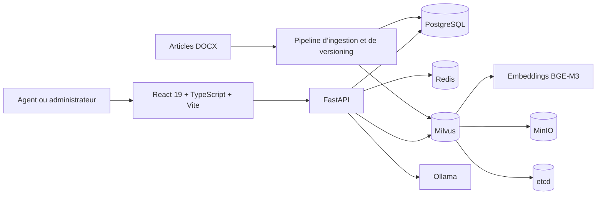

Genius Services

Plateforme interne de connaissance assistée par intelligence artificielle

Genius Services centralise les procédures métier, permet aux agents de rechercher et interroger la base documentaire, et fournit aux administrateurs les outils nécessaires pour gérer les utilisateurs, les contenus, les versions documentaires, les retours et les indicateurs opérationnels.

Le périmètre pilote actuel couvre la base de connaissances FDE. L’architecture a été conçue pour permettre l’extension progressive à d’autres périmètres métier.

> **Statut :** application implémentée et validée sur une architecture Docker Compose mono-VM. La mise en production reste soumise à la validation de l’équipe IT, de l’infrastructure et de la sécurité.

Fonctionnalités principales

Console Agent

• Recherche sémantique et recherche par mots-clés
• Chat RAG avec réponses générées par un modèle local Ollama
• Réponses en streaming et conversations multi-tours
• Sources citées et navigation vers les articles utilisés
• Téléchargement du document DOCX d’origine
• Évaluation positive ou négative des réponses
• Changement de mot de passe et gestion sécurisée de la session

Console Administrateur

• Vue d’ensemble opérationnelle et analytique
• Gestion des utilisateurs, invitations, rôles et statuts de compte
• Suivi de l’activité, des questions fréquentes et du feedback
• Intelligence de la connaissance : tendances, faible confiance, distribution des scores et contenus peu référencés
• Import de nouveaux articles DOCX
• Mise à jour de documents et historique des versions
• Santé du système, audits et supervision des composants

Sécurité et exploitation

• Authentification locale par email et mot de passe
• Mots de passe hachés avec Argon2id
• JWT avec contrôle des rôles admin et agent
• Invalidation des sessions après remplacement des identifiants
• Invitations et réinitialisations de mot de passe à usage unique
• Limitation distribuée des tentatives d’authentification via Redis
• Workflows CI pour la qualité, la sécurité et l’intégration PostgreSQL
• Procédures documentées de déploiement, sauvegarde, restauration et exploitation

Architecture



Rôle des composants

|Composant    |Rôle                                                                                              |
|-------------|--------------------------------------------------------------------------------------------------|
|React / Vite |Interfaces publiques, Agent et Administrateur                                                     |
|FastAPI      |API REST, authentification, recherche, chat, ingestion et analytics                               |
|PostgreSQL   |Source de vérité pour les utilisateurs, documents, versions, chunks, audits, feedback et analytics|
|Milvus       |Index vectoriel dérivé pour la recherche sémantique                                               |
|Redis        |Cache borné et limitation distribuée des requêtes d’authentification                              |
|Ollama       |Génération locale des réponses                                                                    |
|MinIO et etcd|Dépendances de stockage et de coordination de Milvus                                              |

Pipeline documentaire

```text
Article DOCX
    ↓
Validation et extraction
    ↓
Découpage sémantique en chunks
    ↓
Génération des embeddings BGE-M3
    ↓
Métadonnées et versions dans PostgreSQL
    ↓
Vecteurs dans Milvus
    ↓
Recherche hybride et génération avec citations
```

Les documents d’origine restent disponibles pour le téléchargement et la traçabilité. Les mises à jour créent des versions documentaires distinctes.

Technologies

Frontend

• React 19
• TypeScript
• Vite
• React Router
• Axios
• Lucide React

Backend et données

• Python 3.12
• FastAPI
• SQLAlchemy et Alembic
• PostgreSQL
• Milvus
• Redis
• BGE-M3
• Ollama

Infrastructure

• Docker et Docker Compose
• GitHub Actions
• Trivy, Gitleaks, pip-audit et npm audit
• Déploiement mono-VM avec script de déploiement durci

Structure du dépôt

```text
.
├── backend/
│   ├── app/                 # API FastAPI et logique métier
│   ├── frontend/            # Application React/Vite
│   ├── scripts/             # Ingestion, embeddings, benchmarks et opérations
│   ├── tests/               # Tests backend
│   ├── docs/                # Documentation technique et opérationnelle
│   ├── deployment/          # Modèles et ressources de déploiement
│   ├── Dockerfile
│   └── README.md
├── scripts/                 # Automatisation du déploiement VM
├── docker-compose.yml
└── README.md
```

Démarrage local

Prérequis

• Docker Engine
• Docker Compose v2
• Git
• Node.js et npm pour le développement frontend

Lancer les services

Créer ou vérifier le fichier .env selon les variables décrites dans la documentation de déploiement, puis lancer :

```bash
docker compose up -d
```

Vérifier l’état de l’API :

```bash
curl -fsS http://127.0.0.1:8000/api/v1/health
```

Documentation interactive de l’API :

```text
http://127.0.0.1:8000/docs
```

Frontend en développement

```bash
cd backend/frontend
npm install
npm run dev -- --host 127.0.0.1
```

Validation frontend

```bash
cd backend/frontend
npm test
npm run lint
npm run build
```

Les commandes backend exactes et les prérequis de test sont décrits dans la documentation du projet et les workflows CI.

API principale

|Domaine          |Endpoints représentatifs                                                          |
|-----------------|----------------------------------------------------------------------------------|
|Authentification |`/api/v1/auth/signin`, `/api/v1/auth/me`, activation et cycle de mot de passe     |
|Recherche et chat|`/api/v1/search`, `/api/v1/keyword-search`, `/api/v1/chat`, `/api/v1/chat/stream` |
|Sources          |`/api/v1/knowledge/articles/{source_document_id}`, téléchargement du DOCX original|
|Utilisateurs     |`/api/v1/admin/users` et opérations associées                                     |
|Connaissance     |ingestion DOCX, mises à jour et historique des versions                           |
|Analytics        |utilisateurs, questions, opérations, feedback et intelligence de la connaissance  |
|Exploitation     |`/api/v1/health`, statistiques et audits                                          |

La spécification complète est disponible via OpenAPI sur /docs et /openapi.json.

Documentation

• Documentation backend
• Documentation frontend
• Passation production
• Déploiement VM
• Checklist de déploiement
• Runbook d’exploitation
• Sauvegarde et restauration
• Limitations connues et feuille de route
• Checklist de préparation au lancement
• Matrice de responsabilités
• CI et sécurité
• Durcissement de l’authentification
• Cycle des invitations
• Benchmark de performance
• Benchmark des modèles Ollama

Limites actuelles

Les principales limites non bloquantes pour la démonstration, mais importantes avant un lancement production élargi, sont :

• absence de Microsoft Entra ID / SSO et de MFA centralisée ;
• absence d’un fournisseur de messagerie de production pour les invitations et réinitialisations ;
• alerting et observabilité production à mettre en place par l’IT ;
• capacité de charge à valider sur une infrastructure représentative ;
• architecture mono-VM sans haute disponibilité ;
• absence d’un endpoint de restauration d’une ancienne version documentaire ;
• TLS, DNS, Nginx, pare-feu et politiques de production à valider par l’IT.

Consulter Known Limitations and Roadmap pour la liste détaillée, les responsables et les actions recommandées.

Déploiement et responsabilité

Le dépôt contient un workflow GitHub Actions manuel et un script de déploiement VM. Le lancement en production n’est pas automatique et nécessite :

• la validation du commit cible par les workflows CI ;
• un environnement GitHub Production configuré ;
• une VM approuvée et préparée par l’IT ;
• les secrets, accès SSH, DNS, TLS, Nginx et règles réseau appropriés ;
• une validation de sauvegarde, restauration, supervision et capacité.

La répartition complète des responsabilités est décrite dans la matrice de responsabilités.

Périmètre et confidentialité

Genius Services est un projet interne développé pour la gestion et l’exploitation de connaissances métier. Les documents, données, identifiants et configurations de production ne doivent pas être publiés ou stockés dans le dépôt.